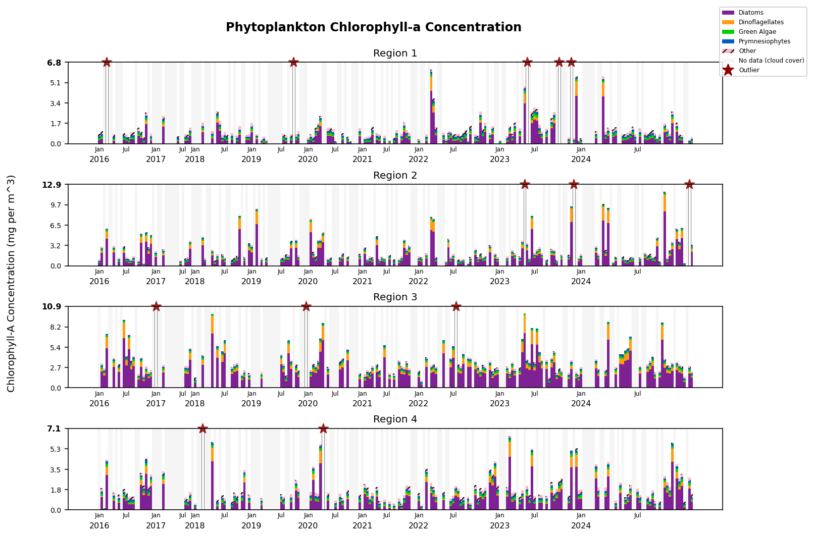
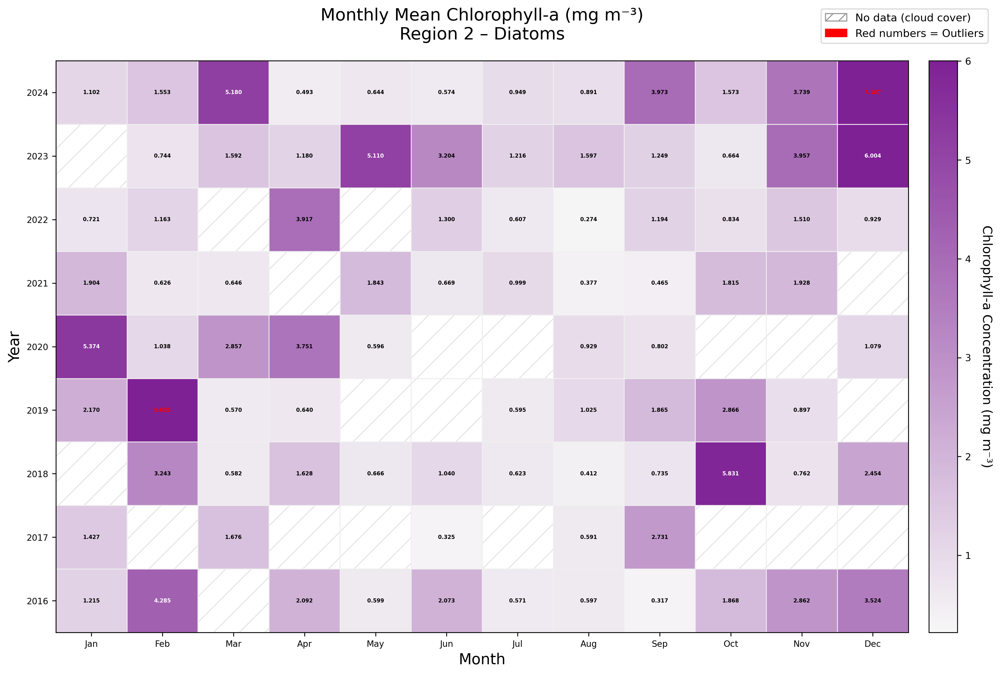
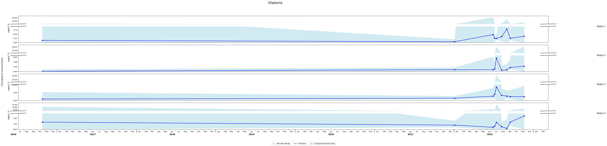

# Past-Projects
Contains descriptions and code samples from relevant past projects.

---
## Mail Delivery Detection
Utilizing Pytorch, I trained CNN models on public datasets and my own custom datasets in order to identify when the mail truck arrived at my house everyday. This involved creating and training two models: one to classify a frame as "mail truck" or "no mail truck" and another to read the timestamp in the upper left of the security camera footage. More detailed description [here](https://github.com/Raindrop182/mail_detection/tree/main)

---
## Minimal Linux Environment From Scratch
I built a minimal Linux environment from scratch using four shell scripts, including:
* Kernel compilation with a custom configuration and embedded initramfs.
* BusyBox root filesystem creation and installation of core userspace services (udev, dhcpcd, chrony).
* Initramfs packaging to produce a bootable image.
* UEFI boot automation in QEMU

---
## MIT Sea Grant UROP

As a researcher in MIT Sea Grant, I visualize and study longterm trends of phytoplankton concentration around the coast of Massachusetts​. By analyzing satellite data, I've created 3 different types of visualizations of phytoplankton species concentrations in 4 key regions around Massachusetts over time. Sample graphs and associated scripts are listed below.
 
 
 

<a href="https://github.com/Raindrop182/Past-Projects/blob/main/Sea_Grant_UROP/code/bar_graph.py">
Bar Graph Code
</a>
   

<a href="https://github.com/Raindrop182/Past-Projects/blob/main/Sea_Grant_UROP/code/heatmap.py">Heat Map Code</a>
 

<a href="https://github.com/Raindrop182/Past-Projects/blob/main/Sea_Grant_UROP/code/trendline.py">Trendline Code</a>
 
 
 
I've also included two smaller automation scripts I wrote, one that <a href="https://github.com/Raindrop182/Past-Projects/blob/main/Sea_Grant_UROP/code/export_photoshop_layers.jsx">exports specific image layers from Photoshop</a> and one that <a href="https://github.com/Raindrop182/Past-Projects/blob/main/Sea_Grant_UROP/code/convert_tiff_to_jpg.py">converts tiffs to jpgs</a>.
 

---
## Arduino-Controlled LED Strip Synced to Laptop with K-means Clustering
   
https://github.com/Raindrop182/Past-Projects/tree/main/Arduino_LED_Strip

In order to sync my laptop screen colors to an arduino-controlled LED strip, I wrote a script to calculate the dominant color of my laptop screen using k-means clustering, and then sent that data to the LED strip.
