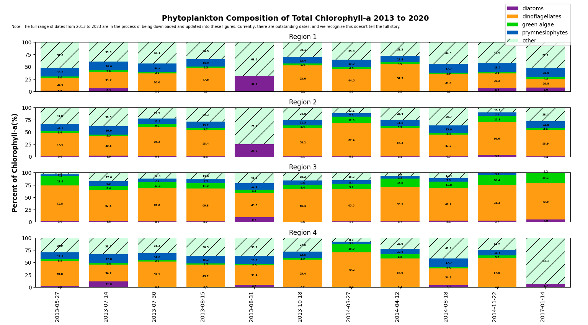

# Past-Projects
Contains descriptions and code samples from relevant past projects.
## MIT Sea Grant UROP

https://github.com/Raindrop182/Past-Projects/tree/main/Sea_Grant_UROP

Most of my coding for the UROP has been debugging and modifying preexisting code to create these visualizations. However, two simple scripts I wrote can be viewed in the link above. One automatically exports all our image layers from Photoshop, and the other converts tiffs to jpgs.

## Arduino-Controlled LED Strip Synced to Laptop with K-means Clustering
https://github.com/Raindrop182/Past-Projects/tree/main/Arduino_LED_Strip

In order to sync my laptop screen colors to an arduino-controlled LED strip, I wrote a script to calculate the dominant color of my laptop screen using k-means clustering, and then sent that data to the LED strip.
