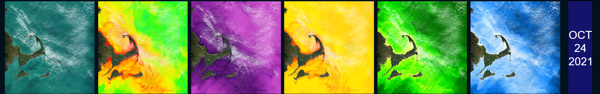
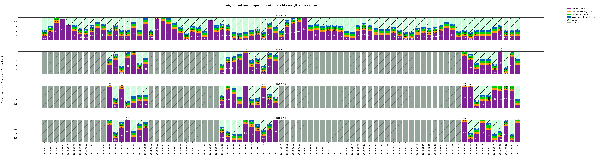
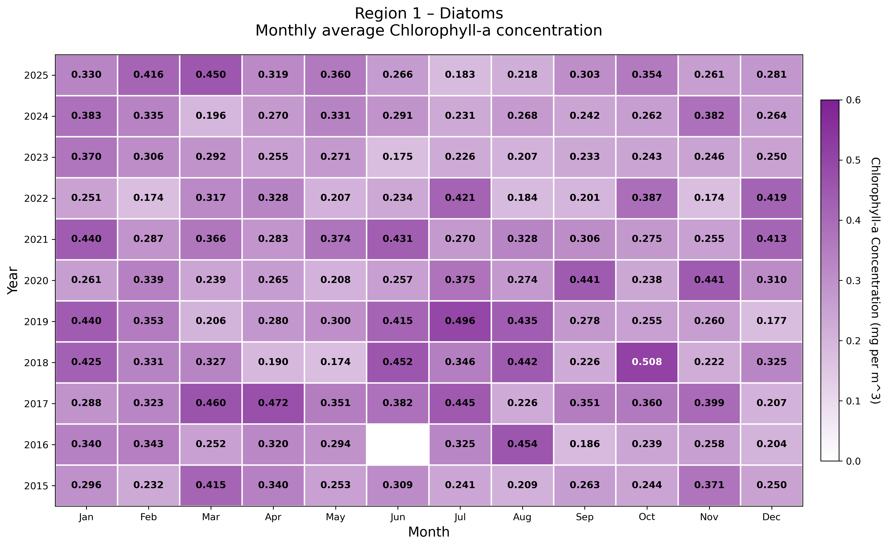
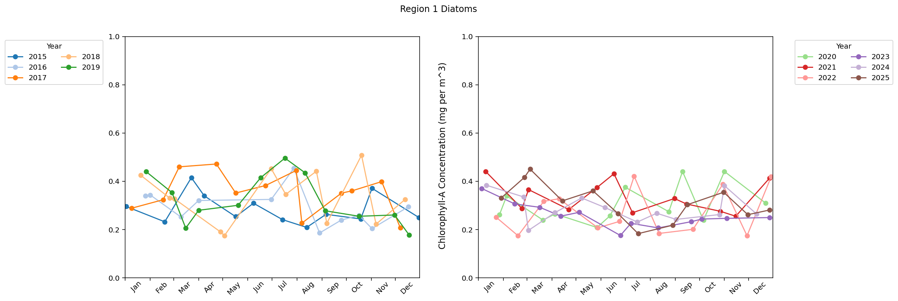
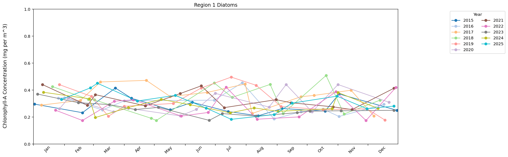
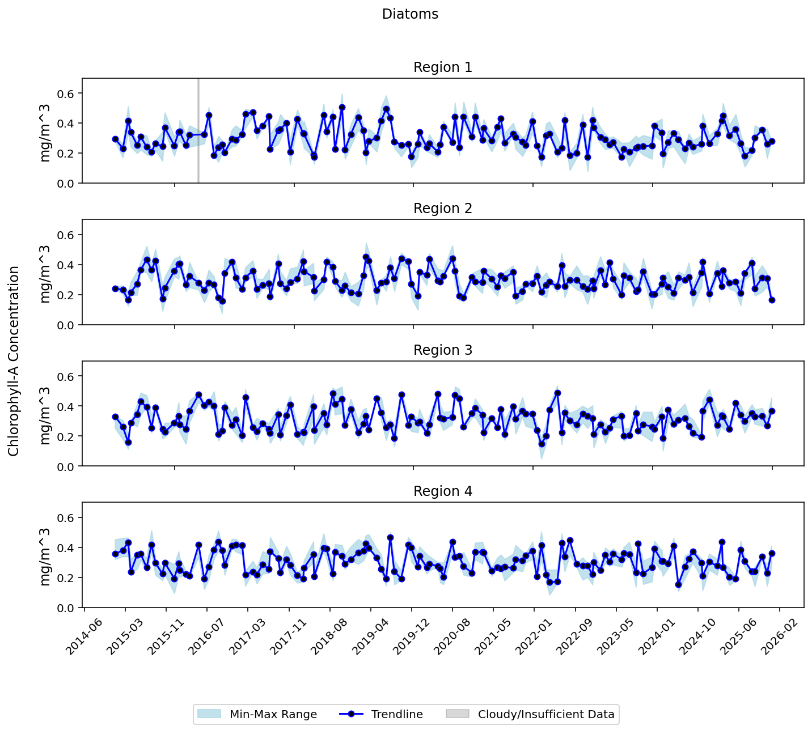

# Past-Projects
Contains descriptions and code samples from relevant past projects.
## MIT Sea Grant UROP

As a researcher in MIT Sea Grant, I am studying plankton concentrations off the coast of Massachusetts by analyzing satellite data. I am currently analyzing and graphing the concentrations of different species of plankton in 4 key regions around Massachusetts over time. Although we are still in the process of acquiring and graphing real data, I've included my code and sample visualizations based on fake, test data below. 

<a href="https://github.com/Raindrop182/Past-Projects/blob/main/Sea_Grant_UROP/code/bar_graph.py">Bar Graph Code</a>

<a href="https://github.com/Raindrop182/Past-Projects/blob/main/Sea_Grant_UROP/code/heatmap.py">Heat Map Code</a>

<a href="https://github.com/Raindrop182/Past-Projects/blob/main/Sea_Grant_UROP/code/line_graph.py">Line Graph Code</a>

<a href="https://github.com/Raindrop182/Past-Projects/blob/main/Sea_Grant_UROP/code/trendline.py">Trendline Code</a>

I've also included two smaller automation scripts I wrote, one that <a href="https://github.com/Raindrop182/Past-Projects/blob/main/Sea_Grant_UROP/code/export_photoshop_layers.jsx">exports specific image layers from Photoshop</a> and one that <a href="https://github.com/Raindrop182/Past-Projects/blob/main/Sea_Grant_UROP/code/convert_tiff_to_jpg.py">converts tiffs to jpgs</a>.

## Arduino-Controlled LED Strip Synced to Laptop with K-means Clustering
https://github.com/Raindrop182/Past-Projects/tree/main/Arduino_LED_Strip

In order to sync my laptop screen colors to an arduino-controlled LED strip, I wrote a script to calculate the dominant color of my laptop screen using k-means clustering, and then sent that data to the LED strip.
